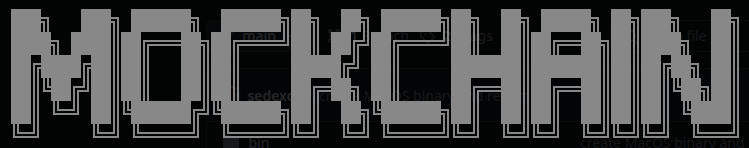

<br/>
<p align="center">
  
</p>
<br/>

# 📘 Mockchain: Blockchain Simulation

Mockchain is a terminal based, menu-driven program written in Rust that allows you to create a basic blockchain simulation environment.

-   Learn about blockchain technology
-   Understand a simplified version of Proof of Work (PoW) cryptocurrency
-   Expose all elements including secure values like private keys
-   Break a blockchain safely

# ✨ Features

-   ✅ Mining blocks to add to the chain
-   ✅ Generating tokens
-   ✅ Creating transactions between accounts
-   ✅ Wallet creation
-   ✅ Public key cryptography and hashing
-   ✅ Digital signing of transaction hashes
-   ✅ Chain verification

# 📦 Installation

## Prerequisites

```bash
Rust >= 1.79.0
```

## Local Setup

-   Install [Rust](https://www.rust-lang.org/tools/install)
-   Clone repo to your local machine

```bash
# Clone the repository
git clone https://github.com/sedexdev/mockchain.git
cd mockchain
cargo run
```

## Binaries

-   Binary files are available in the [bin](https://github.com/sedexdev/mockchain/tree/main/bin) directory for _Windows / Linux / MacOS_
-   After downloading run the binary inside a terminal

```bash
# Linux
cd mockchain
chmod +x mockchain
./mockchain

# Windows
cd mockchain
.\mockchain.exe

# MacOS
cd mockchain
chmod +x mockchain_darwin
./mockchain_darwin
```

-   _TIP_: Update the `PATH` for your OS to launch the program from anywhere

# 🛠️ Usage

The following integer-based options are available during execution:

-   `0` - Show options menu
-   `1` - Create a wallet
-   `2` - Mine a block
-   `3` - Add a new transaction
-   `4` - Display the blockchain
-   `5` - Display pending transactions
-   `6` - Display wallets
-   `7` - Display key pairs
-   `8` - Display signatures
-   `9` - Re-initialise blockchain
-   `10` - Verify blockchain
-   `11` - Exit

Displaying output sends information to `stdout`.

## App data files

The following directories will be created under your HOME directory (Windows/MacOS/Linux HOME folder locations are supported using the [dirs](https://crates.io/crates/dirs) crate):

-   `.mockchain/data/`
    -   blockchain.json
    -   keypairs.json
    -   signing.json
    -   transactions.json
    -   wallets.json
-   `.mockchain/log/`
    -   log.txt

For learning it is recommended that you read the output in these files to see what is going when you perform an action (e.g. mine a new block). The log file has more detailed descriptions of what is happening behind the scenes, while the JSON data files hold information relevant to the blockchain and the accounts associated with it.

# 📂 Project Structure

```
mockchain/
│
├── assets/             # Repo header image file
├── bin/                # Binary executables
├── src/                # Source files
├── .gitignore          # Ignore file for git
├── Cargo.lock          # Cargo dependency versions
├── Cargo.toml          # Package configuration
├── LICENSE             # MIT license file
└── README.md           # This README.md file
```

# 🧪 Running Tests

```bash
# from project root
cargo test
```

# 🐛 Reporting Issues

Found a bug or need a feature? Open an issue [here](https://github.com/sedexdev/your-repo-name/issues).

# 🧑‍💻 Authors

-   **Andrew Macmillan** – [@sedexdev](https://github.com/sedexdev)

# 📜 License

This project is licensed under the MIT License - see the [LICENSE](https://github.com/sedexdev/mockchain_v2/blob/main/LICENSE) file for details.
